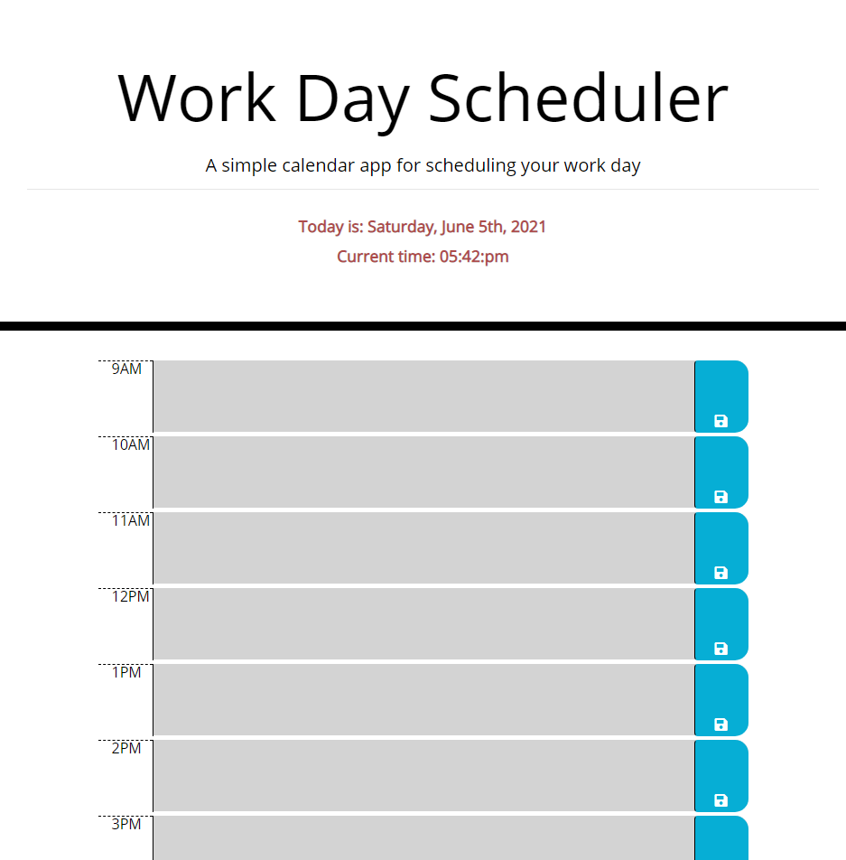

# Work Day Scheduler

## Table of Contents

* Description
* Usage
* Images

## Description

> Goals for this assignment included the following:

1. Using starter code, create a calendar application that allows user to save events or tasks for each hour of the typical workday.

2. Incorporate dynamically updated HTML and CSS powered by jQuery and Moment.js functionality.

## Usage

>Access the webpage here: <https://pao1ag.github.io/Workday-Scheduler/>

This web application can be used as a daily planner for the workday. Events/tasks are saved through the save button. These can be revisited even after page reload. 

Dynamically changed color in the textarea represents the time status of the workday. The color grey is for timeblocks that have passed, red indicates the current hour timeblock, and green indicates upcoming hours. An additional purple color signifies that the user is visiting the scheduler during the weekend.

## Images

